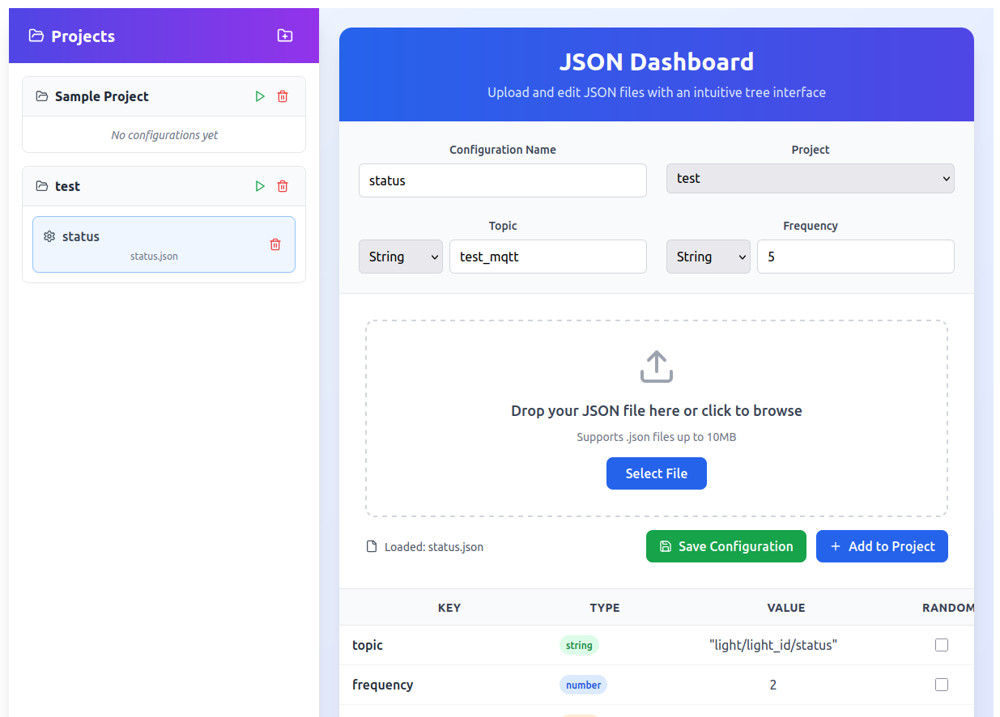

# mqtt_simulator

## This project is a practical implementation of the mqtt mochi package

It allows :

- adding, editing, deleting a configuration file in the UI
- adding a MQTT topic to publish the configuration to
- adding the publication frequency of the configuration to the MQTT topic

Using the application starts with :

1. Creating a new project, using the "+" icon, in the left hand side menu
2. Adding a new configuration to a project
    1. Enter a name for the configuration
    2. Select which project to add the configuration to, from the dropdown menu
    3. Enter a name for the MQTT topic to publish to
    4. Enter a value for the publication frequency of MQTT messages
    5. Add a JSON file. That JSON includes the content of the MQTT message that will be published

To start publishing the MQTT message, hit the play icon, next to the project name

Below is a screenshot sample of the UI.

## Stack

### Frontend : React, Typescript, Vite, Tailwind

### Backend : Go

